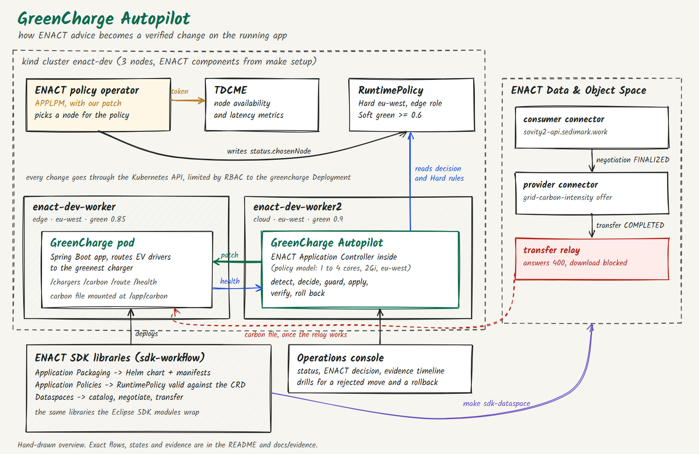
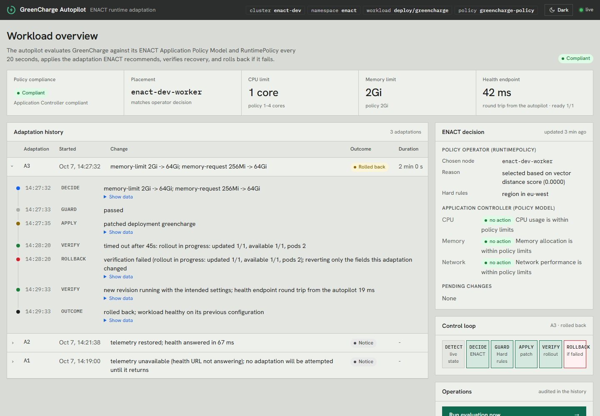
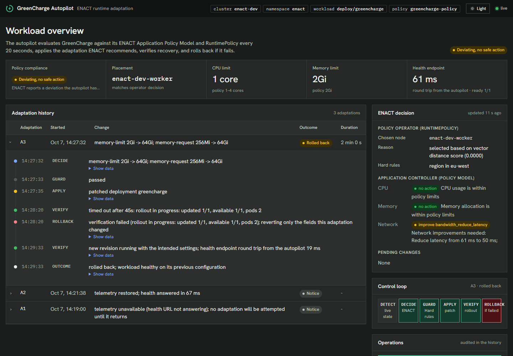
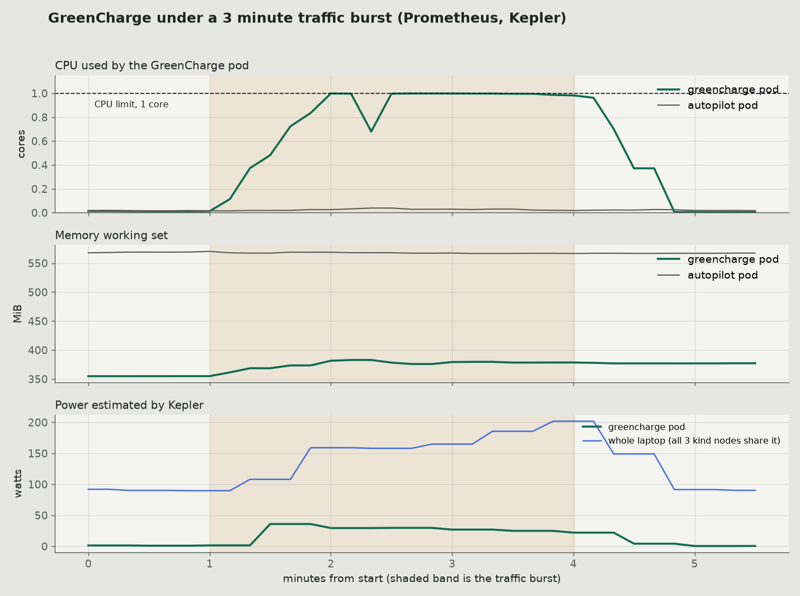

<p></p>

# GreenCharge Autopilot

Veles Hack 2026, Challenge 3 (ENACT Kubernetes Dynamic Adaptation), by Team Harrie.

ENACT can tell you what a workload should look like. The Application Controller
recommends `scale_up` or `scale_down`, and the policy operator picks a node for
it. In the versions given for this challenge (`application-controller` 1.0.0
and the APPLPM image `main-appl`), neither one changes the running workload.
In the hackathon cluster the operator could not even make a decision, because
every call it made for metrics was refused.

GreenCharge Autopilot connects those pieces for GreenCharge, the EV charger
routing app from the challenge. When the app breaks its policy, ENACT works out
what should change and the autopilot makes that change on the cluster. It then
checks that the app came back healthy and undoes the change if it did not.

Everything here was run on the challenge's own 3 node kind cluster (`make setup`).
Each adaptation is written to an evidence log that anyone can inspect.

**In short**

- App out of policy (half a core on the wrong node) was fixed and verified in 105 s
- A change that could not become healthy was rolled back in 100 s
- A move to a node outside the allowed region was refused and the app was left alone
- The ENACT operator could not make any decision as shipped. Our patch fixes that, with tests



---

## Results on the live cluster

These runs were recorded on 7 October 2026. The raw records are in
[docs/evidence/](docs/evidence/) as `run1` to `run4`. Each run has the evidence
log in JSON lines plus the RuntimePolicy status and the pod list at the end.

| # | Scenario | What happened | Result |
|---|---|---|---|
| 0 | The ENACT operator makes a decision (after the [operator fix](operator-fix/)) | The RuntimePolicy reads live TDCME metrics for every node and picks `enact-dev-worker2`. The control plane is listed as rejected because it has no region | Decision made. Before the fix it reported `no available metrics` |
| 1 | GreenCharge starts outside its policy, with a 500m CPU limit (the policy asks for at least 1 core) and on a node the operator did not pick | The Application Controller says *"Need to increase CPU from 0.50 cores to 1 cores"*. The autopilot raises the limit to 1 core and moves the pod to `enact-dev-worker2`. The rollout is verified and the health check answers in 55 ms | Adapted and verified in 105 s |
| 2 | Someone asks for a move to a node outside the Hard region | The guard refuses it because region `us-east` is not in the allowed list `[eu-west]` | Rejected, workload untouched |
| 3 | A change that can never become healthy (64Gi of memory, more than any node has) | The new pod cannot be scheduled. Verification gives up after 45 s and the autopilot puts back only the memory settings it changed. The earlier CPU change (500m to 1) stays. The health check answers in 38 ms afterwards | Rolled back in 100 s |
| 4 | A node leaves `eu-west` (worker2 relabelled `us-east`) | The operator moves its choice to `enact-dev-worker` and records why worker2 no longer qualifies. The autopilot moves GreenCharge, the rollout is verified and the health check answers in 17 ms. When worker2 returns to `eu-west` the operator keeps its new choice (watched for 40 s, two reconcile periods) and does not flip back | Adapted and verified in 105 s |
| 5 | The policy is limited to edge nodes (`enact.eu/role=edge`), since the brief places GreenCharge on `enact-dev-worker` | The operator picks `enact-dev-worker`. The autopilot moves GreenCharge there and restores the 1 core minimum that a Helm upgrade had reset. The health check answers in 19 ms | Adapted and verified in 97 s |
| 6 | Telemetry disappears (GreenCharge scaled to zero) | The status changes to *Telemetry unavailable*, first because the health URL stops answering and then because there is no running pod. The autopilot changes nothing during that time (the Deployment generation moved only because of the scale command). When the app comes back the recovery is recorded. The first slow answers (67 ms against a 50 ms target) are shown as *Deviating* until they settle, and the console does not call them *Compliant* | No unsafe action, and the state shown matched reality the whole time |

### The operations console

Run `make autopilot-ui` and open <http://localhost:8090/autopilot.html>. The
console shows the state of the workload, what ENACT decided and each adaptation
step by step. In the screenshot below, a change asking for 64Gi of memory (more
than any node has) is caught and rolled back. The telemetry loss and recovery
from scenario 6 appear as notices.



<details><summary>Dark theme</summary>



</details>

This is the evidence log for one adaptation, exactly as the autopilot wrote it.

```text
08:18:35 A1 DETECT   workload deviates from policy
08:18:35 A1 DECIDE   cpu-limit 500m -> 1; node enact-dev-worker -> enact-dev-worker2
08:18:35 A1 GUARD    passed
08:18:36 A1 APPLY    patched deployment greencharge
08:20:01 A1 VERIFY   rollout complete and health check answered in 55 ms
08:20:20 A1 OUTCOME  adapted and verified
```

Each record also keeps the data behind it. That includes the measured limits
and usage, the full Application Controller recommendation, the operator's
decision with its reason, and the state before and after.

### Monitoring under load (step 6 of the brief)

`make load` sends 3 minutes of traffic at GreenCharge from inside the cluster
(12 workers calling `/route` and `/chargers`). The chart below comes from the
cluster's own Prometheus and Kepler during one such burst on 7 October. The
same series are on the Grafana dashboards at <http://localhost:3000>, and the
raw query results are in [docs/evidence/load/](docs/evidence/load/).



| | Before | During the burst | After |
|---|---|---|---|
| GreenCharge CPU | 0.01 cores | 0.97 cores (held at its 1 core limit) | 0.01 cores |
| GreenCharge memory | 355 MiB | 380 MiB | 377 MiB |
| GreenCharge power (Kepler) | about 1 W | about 27 W, peak 36 W | under 1 W |
| Whole laptop power (Kepler) | about 91 W | about 173 W | about 91 W |

The autopilot stayed *Compliant* and changed nothing during the burst, which
is the correct behaviour for this policy. The Application Controller in version
1.0.0 judges the resources the app is given (a limit of 1 to 4 cores), not how
busy it is, so a 1 core limit is within policy even when it is fully used.
Scaling on load would need a usage rule in the policy model, and that is the
next thing we would add. Kepler figures on a laptop come from its model and
not from hardware counters, so treat them as a relative signal.

## Using the ENACT SDK from scripts

The Eclipse modules of the ENACT SDK are a user interface on top of the ENACT
libraries published on Maven Central. The SDK README says the same validated
code runs inside and outside Eclipse. [`sdk-workflow/`](sdk-workflow/) calls
those libraries directly, at the versions bundled with SDK 1.5.0, so each SDK
step in the brief can be repeated with one command.

| Step in the brief | SDK module and library | Command | Result |
|---|---|---|---|
| Package the app as a Helm chart (image, port 8080, service, ingress `greencharge.local`) | Application Packaging, `eu.enact-horizon` `app-packaging` 1.0.0 | `make sdk-package` | Chart and manifests in [`greencharge/enact-sdk-generated/`](greencharge/enact-sdk-generated/). They pass a server side dry run against the live cluster |
| Write the RuntimePolicy | Application Policies, `eu.enact-horizon` `application-policy-model` 0.1.0 | `make sdk-validate-policy` | Reported as VALID against the `enact.eu/v1alpha1` RuntimePolicy CRD |
| Connect to the Data and Object Space | Dataspaces, `eu.enact-horizon` `edc-client` 1.2.0 | `make sdk-dataspace` | Finds the connector, reads the catalog, negotiates (FINALIZED), transfers (COMPLETED) and tries the download. The log is in [`docs/evidence/dataspace/5-sdk-edc-client-run.txt`](docs/evidence/dataspace/5-sdk-edc-client-run.txt) |
| Use the Application Controller | `eu.enact-horizon` `application-controller` 1.0.0 | `make test` | Compliance checks plus the `scale_up` and `scale_down` advice that drives the autopilot |

Doing this turned up one problem. The packaging library always probes `/health`
on the container port, whatever probe path you ask for, and it sets no startup
delay. GreenCharge had no `/health` endpoint, so a generated chart restarted it
over and over. Other teams worked around that crash loop by editing the chart.
GreenCharge now serves `/health`, so the generated chart works as it is.

## What was built

| File or folder | Challenge task | What it does |
|---|---|---|
| `greencharge/src/main/resources/reconciliation/policymodel.yml` | 2, policy model | x86_64, 1 to 4 cores, 2Gi DDR4, at most 100 W, green energy mix of at least 0.60, region `eu-west`, latency up to 50 ms |
| `compliance/` | 3, Application Controller | `PolicyCompliance` runs ENACT's `ComplianceAndAdaptationService` against the policy model. Spring wires in the controller's own `PolicyModelConfig`, so nothing reaches into private fields |
| `autopilot/` | 3 and 5, adaptation | A control loop that runs in its own Deployment, so restarting GreenCharge never stops it. It detects, decides, guards, applies, verifies and rolls back, and records every step |
| `chart/templates/runtimepolicy.yaml` | 4, RuntimePolicy | Soft green ratio of at least 0.6, Hard region `eu-west`, node availability of at least 0.9 |
| `chart/templates/autopilot.yaml` | 5, deployment | The autopilot Deployment with tight RBAC. The only workload it may patch is the `greencharge` Deployment |
| `operator-fix/` | 5, placement | A patch to the ENACT operator so it can read metrics, make a decision and explain it. Details are in [operator-fix/README.md](operator-fix/README.md) |
| `chart/templates/deployment.yaml` | | Adds a startup probe. A JVM on half a core needs more than a minute to start and the liveness probe was killing it |
| `SecurityConfig.java` | | The Application Controller library quietly turns on Spring Security, which made every endpoint answer 401, health probes included |

The brief names the image `greencharge:1.0`. Our charts use later tags (`1.5` in
the SDK generated chart, `1.7` in the chart we deploy) because each fix above
produced a new build, and a new tag makes kind load the new image instead of a
cached one.

### The control loop

```text
                    every 20 s
   ┌──────────────────────────────────────────────────────────────┐
   │ DETECT   live limits, usage, node and health of GreenCharge  │  Kubernetes API, metrics-server
   │ DECIDE   ENACT Application Controller recommendation         │  policymodel.yml
   │          + ENACT operator's chosenNode for the RuntimePolicy │  RuntimePolicy status (patched operator)
   │ GUARD    target node must satisfy the policy's Hard rules;   │
   │          no second adaptation within the cooldown            │
   │ APPLY    patch the Deployment, snapshot the old pod template │
   │ VERIFY   rollout complete + health URL answers 200,          │
   │          pods actually on the target node                    │
   │ ROLLBACK restore the snapshot if VERIFY times out            │
   └──────────────────────────────────────────────────────────────┘
          every step → evidence timeline (/autopilot.html, JSON, logs)
```

The loop changes two things.

- CPU and memory limits. The Application Controller compares the container's
  limits with the policy model and answers `scale_up` or `scale_down` with a
  target value. The autopilot applies that value and keeps requests at or
  below the limits.
- Placement. When the pods are not on the operator's `chosenNode`, the
  autopilot pins them to it with a `kubernetes.io/hostname` node selector. It
  only does this if that node passes the RuntimePolicy's Hard rules.

## Run it

You need what [SETUP.md](SETUP.md) lists (Docker, kind, kubectl, Helm and make),
plus JDK 21 and Maven to build the app.

```bash
make setup          # the organisers' ENACT cluster (see SETUP.md)
make labels         # node labels, in case APPLPM was not ready during setup
make test           # 13 unit tests, including the two required by the challenge
make image          # build GreenCharge and load it into kind
make operator-fix   # build the patched ENACT operator and give it the TDCME token
make deploy         # GreenCharge, the RuntimePolicy and the autopilot, through Helm
make autopilot-ui   # opens the console on localhost port 8090
make load           # 3 minutes of traffic for the monitoring step
```

To repeat three of the scenarios above, run the following.

```bash
kubectl -n enact port-forward svc/greencharge-autopilot 8090:8080 &

# 1. The guard refuses a move outside eu-west
kubectl label node enact-dev-control-plane enact.eu/region=us-east --overwrite
curl -X POST "localhost:8090/autopilot/drills/move?node=enact-dev-control-plane"

# 2. A change that cannot become healthy is rolled back
curl -X POST "localhost:8090/autopilot/drills/failed-adaptation?verifySeconds=45"

# 3. A node leaves eu-west, the operator picks again and the autopilot moves the app
kubectl label node enact-dev-worker2 enact.eu/region=us-east --overwrite
```

`make evidence` prints every evidence record as JSON lines.

## Problems found in ENACT

1. The ENACT operator could not place anything. TDCME answered 401 and the
   operator had no setting for a token, and its metrics settings were empty.
   Under a Hard location rule it also ranked every node again on each pass.
   [operator-fix/](operator-fix/) fixes both, with tests, and is ready to be
   sent upstream as a merge request.
2. `application-controller` switches on Spring Security in any app that uses
   it. Kubernetes probes then fail until the app adds its own security settings.
3. The operator only decides and never moves a workload. Its choice also
   sticks, so a greener node will not cause a move while the current node still
   passes the Hard rules. The autopilot carries out the operator's decisions and
   does not overrule them.
4. `SETUP.md` (the organisers' guide) gave the APPLPM port as 35080, but kind
   maps it to 35580. This repository has the corrected number.

## What running it on the cluster changed

None of these were planned. Each one showed up while the autopilot was running
on the live cluster.

- A rollback should only undo its own change. The first version restored the
  whole saved pod template. During a `helm upgrade` an older autopilot pod was
  still checking an earlier change, and when that check timed out its rollback
  also undid the new image Helm had just set. Now a rollback only restores the
  fields its own change touched. If the Deployment's generation has moved since
  the patch, meaning someone else changed it, the rollback is skipped. The test
  `rollbackRevertsOnlyTheFieldsTheAdaptationChanged` covers this.
- Counting one replica is the wrong way to judge success. On a busy node an old
  pod can take minutes to finish shutting down, so the Deployment reports 2
  pods long after the new one is serving traffic. Verification kept timing out
  on changes that had actually worked. A change now counts as successful when
  the new spec has been observed, the new ReplicaSet is available
  (`Progressing=NewReplicaSetAvailable`), the health URL answers 200 and the
  pods really carry the change. `availableReplicas` alone is not enough because
  it also counts old pods.
- The API server is the first check. A drill that asked for a 64Gi memory
  request above a 2Gi limit was refused straight away, and the autopilot used
  to report that as an HTTP 500. Now a refused patch is recorded as
  `not_applied` together with the API server's reason, and the workload stays
  as it was.

## Limits

- What the autopilot checks by itself. Before a move it checks the target
  node's readiness, region, zone and Hard green ratio from the node labels. It
  relies on the ENACT operator for availability and latency and does not
  measure those again. After a change it confirms that pods from the new
  revision are Ready, have the intended CPU, memory and node, and that the
  app's health endpoint answers.
- Which latency is meant. The health round trip is measured by the autopilot
  from inside the cluster to GreenCharge's `/chargers` endpoint. That number is
  given to the Application Controller as the network latency to compare with
  the 50 ms target in the policy model. It is not the cluster latency the
  operator gets from TDCME, and the autopilot shows it without acting on it.
- Missing telemetry is reported and never guessed. If the app does not answer,
  has no running pod, or its limits cannot be read, the status becomes
  *Telemetry unavailable* and nothing is changed until the data returns. If
  ENACT reports a problem the autopilot has no safe fix for (network latency
  for example), the status is *Deviating* and never *Compliant*.
- Sticky placement. The operator keeps a chosen node while it still passes
  the Hard rules, so a greener node that appears later does not lead to a move.
  The autopilot follows the operator's decision and does not overrule it.
- The dataspace (task 1). Every step runs through the SDK's EDC client with
  `make sdk-dataspace`. The consumer connector is found (API v2, push only),
  the provider's catalog offers `grid-carbon-intensity`, the contract
  negotiation reaches FINALIZED and the transfer reaches COMPLETED, with the
  provider pushing the data to the organisers' transfer relay. Downloading from
  that relay is the one step that fails. On 7 October the relay answered every
  request, even its own `/health`, with
  `400 Client sent an HTTP request to an HTTPS server`. The records are in
  [docs/evidence/dataspace/](docs/evidence/dataspace/) and the problem has been
  reported to the mentor. Until it is fixed GreenCharge uses its built in mock
  carbon data. Once the relay works, `make sdk-dataspace` saves the file to
  `docs/evidence/dataspace/`, and pointing `carbon.feed.file` at it is the only
  step left. The app reads the file again on every request.
- Measured and declared values. CPU and memory limits, usage, node placement
  and health latency are all measured live. Link bandwidth is declared as
  1000 Mbps because the virtual links in kind cannot be measured in a useful
  way, so the 100 Mbps floor in the policy model is not really tested.
- Kepler energy figures on a laptop under WSL2 come from Kepler's model and not
  from hardware counters. This entry makes no claim about saving energy.
- Evidence is kept in memory (the last 500 records) and in the autopilot's
  logs. It is not written to durable storage.
- GreenCharge runs as a single replica. The rollout check in the verify step is
  written for any number of replicas but has only been tried with one.

## Slides and video

The pitch deck is [docs/submission/GreenCharge-Autopilot-slides.pptx](docs/submission/GreenCharge-Autopilot-slides.pptx).
It follows the organisers' template (project, GitHub repo, summary, highlights) and uses
Hanken Grotesk, a free Google font. The slide images shown on TAIKAI are in
[docs/submission/slides/](docs/submission/slides/).
A 52 second overview video is at
[docs/submission/GreenCharge-Autopilot-demo.mp4](docs/submission/GreenCharge-Autopilot-demo.mp4).

## Licence

Apache-2.0, the same licence as the ENACT components this builds on. See
[LICENSE](LICENSE).
